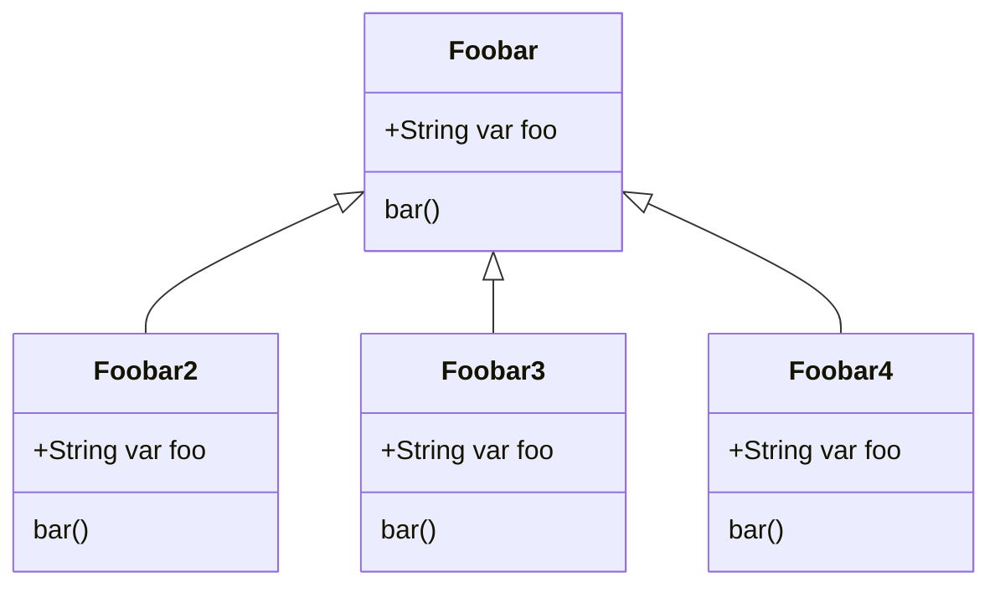

# PythonToMarkdown

Generates a mermaid class diagram in markdown from python source code.
This project is based on RafaelKuebler's [PyToUML](https://github.com/RafaelKuebler/PyToUML), which generates a plantUML 
diagram based on the source data.

This project generates a text file containing [Mermaid](https://mermaid-js.github.io/mermaid/#/README) markdown class diagrams
based on the source code of a Python project.

## Using PythonToMarkdown

You will need to have Java installed in order to use PythonToMarkdown. Run the tool through the command line as follows:
> python run.py <SOURCE_PATH>

## License

This project is licensed under the MIT License - see the [LICENSE.md](LICENSE.md) file for details
